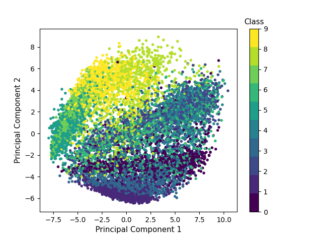
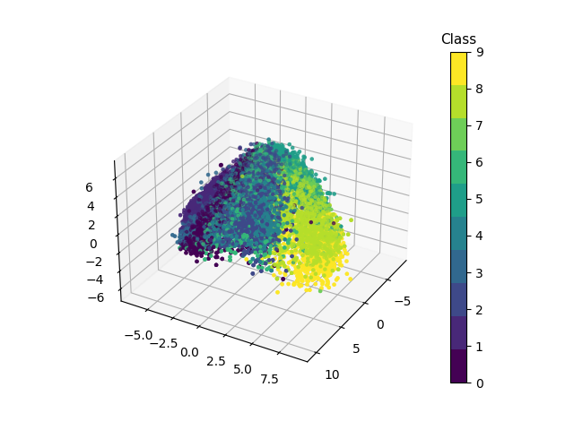

# Report - Challenge 1

*Advanced Topics for Machine Learning*

---

*Da Vinchie Lisa, Pettenà Piero*

*15/11/2023*

---

## Table of Contents

1. [Introduction](#introduction)
2. [Exercise 1](#exercise-1)
3. [Exercise 2](#exercise-2)
4. [Exercise 3](#exercise-3)
5. [Exercise 4](#exercise-4)
6. [Conclusion](#conclusion)

---

## Introduction {#introduction}

In this challenge, our goal is to find an effective method to classify the images of the *FashionMNIST* dataset, based on their content. The dataset is formed by black-and-white images of 28 $\times$ 28 pixel, each one representing a clothing item belonging to one of the following 10 cathegories:

1. T-shirt or top
2. Trouser
3. Pullover
4. Dress
5. Coat
6. Sandal
7. Shirt
8. Sneaker
9. Bag
10. Ankle boot

---

## Exercise 1{#exercise-1}

The goal of this exercise is to perform Principal Component Analysis (PCA) in order to find out how the clusters are separated. In order to do that, we performed two kinds of PCA: linear and kernel PCA; then, we plotted the first two and three principal components, along with the true labels.

::: {#fig:linear_pca_2comps width=0.2\textwidth}

:::

::: {#fig:linear_pca_3comps caption="First three principal components obtained by performing linear PCA" width=0.2\textwidth}

:::

---

## Exercise 2{#exercise-2}

---

## Exercise 3{#exercise-3}

---

## Exercise 4{#exercise-4}

---

## Exercise 5{#exercise-5}

---

## Conclusion {#conclusion}

Summarize your findings and conclude your report.